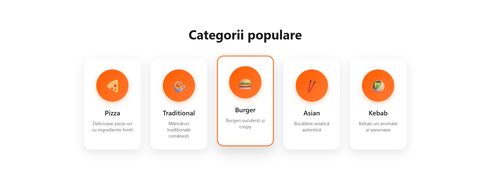
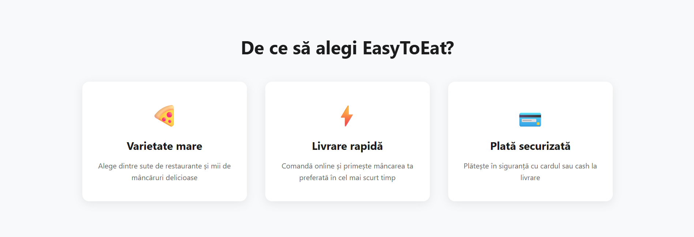
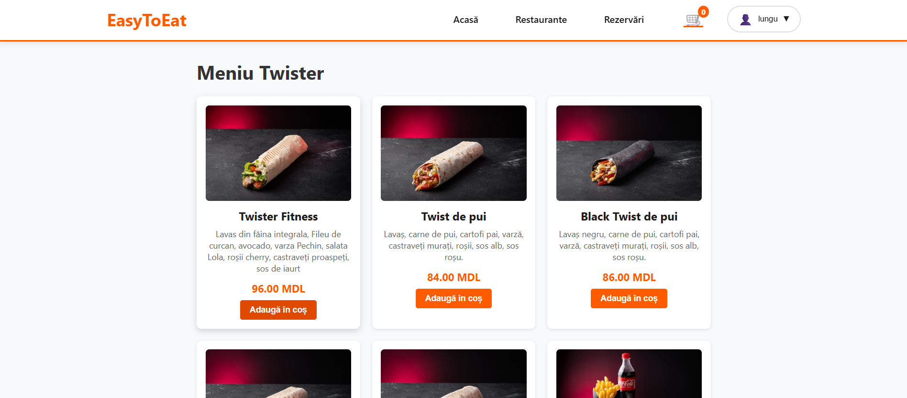
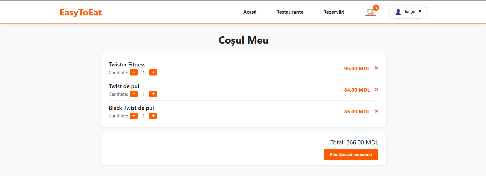
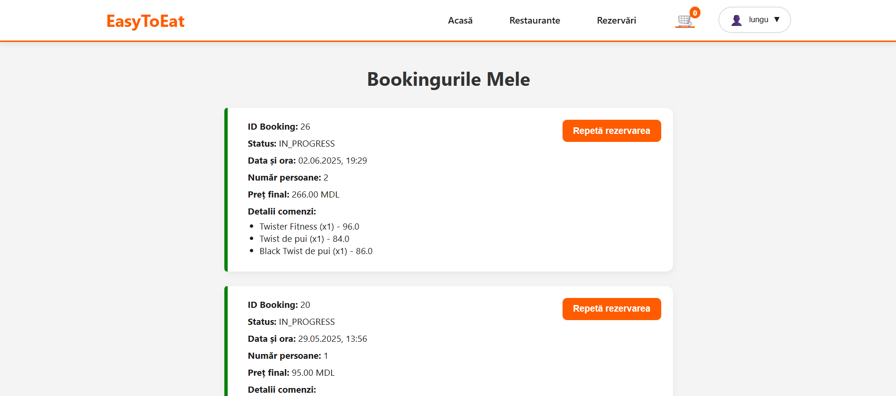
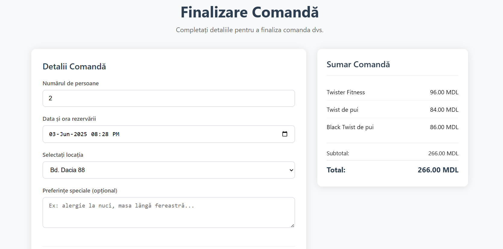
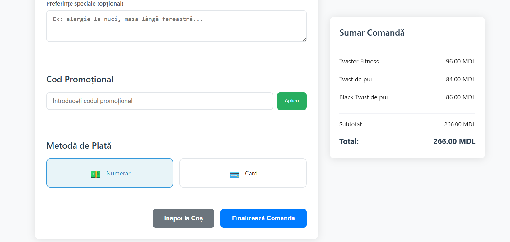

# 🍽️ EasyToEat - Restaurant Booking & Delivery Platform

> A comprehensive web platform for restaurant reservations, pre-orders, and delivery services implementing **12 Design Patterns** with real functionality.

## 📋 Table of Contents
- [🌟 About](#-about)
- [🏗️ Architecture](#️-architecture)
- [🎨 Design Patterns Implementation](#-design-patterns-implementation)
- [💻 Backend (REST API)](#-backend-rest-api)
- [🎯 Frontend (Thymeleaf)](#-frontend-thymeleaf)
- [🗄️ Database](#️-database)
- [🚀 Getting Started](#-getting-started)
- [📱 Features](#-features)
- [🛠️ Technologies Used](#️-technologies-used)
- [👨‍💻 Author](#-author)

## 🌟 About

EasyToEat is a modern web platform that revolutionizes the restaurant experience by providing:
- 📅 **Table Reservations** - Book your favorite spots
- 🍕 **Pre-ordering** - Order ahead of time
- 🚚 **Delivery Services** - Food delivered to your door
- 💳 **Multiple Payment Options** - Flexible payment methods
- 📧 **Smart Notifications** - Stay updated with your orders

This project demonstrates the practical implementation of **12 essential Design Patterns** in a real-world application, showcasing clean architecture and maintainable code.

## 🏗️ Architecture

The application follows a layered architecture pattern with clear separation of concerns:

```
Frontend (Thymeleaf) ↔ REST API (Spring Boot) ↔ PostgreSQL (Docker)
```

## 🎨 Design Patterns Implementation

### 🏗️ Creational Design Patterns

#### 🔨 Builder Pattern
**Implementation**: `LoginResponseDTO`
- **Purpose**: Constructs complex login response objects step by step
- **Usage**: Creates structured responses with user data, tokens, and permissions
- **Benefits**: Flexible object creation, readable code, optional parameters

#### 🧬 Prototype Pattern
**Implementation**: `Booking Reorder`
- **Purpose**: Creates new bookings based on existing ones
- **Usage**: Allows users to quickly reorder previous bookings
- **Benefits**: Efficient object cloning, maintains booking history

#### 🏭 Factory Pattern
**Implementation**: `Payment Type & Discount Type`
- **Purpose**: Creates payment processors and discount calculators dynamically
- **Usage**: Instantiates appropriate payment/discount handlers based on type
- **Benefits**: Extensible payment methods, easy to add new discount types

#### 🎯 Singleton Pattern
**Implementation**: `Table Service`
- **Purpose**: Ensures single instance of table management service
- **Usage**: Centralized table availability management
- **Benefits**: Global access point, resource efficiency

### 🏗️ Structural Design Patterns

#### 🔌 Adapter Pattern
**Implementation**: `External Card Payment Adapter`
- **Purpose**: Integrates third-party payment systems
- **Usage**: Adapts external payment APIs to internal payment interface
- **Benefits**: Seamless integration, vendor independence

#### 🎭 Decorator Pattern
**Implementation**: `Discount System`
- **Purpose**: Applies multiple discount layers dynamically
- **Usage**: Combines seasonal, loyalty, and promotional discounts
- **Benefits**: Flexible discount combinations, runtime enhancement

#### 🏛️ Facade Pattern
**Implementation**: `Create Booking`
- **Purpose**: Simplifies complex booking creation process
- **Usage**: Provides single interface for table checking, payment, and confirmation
- **Benefits**: Simplified client interface, encapsulates complexity

#### 🛡️ Proxy Pattern
**Implementation**: `User Role Verification`
- **Purpose**: Controls access to item creation/deletion operations
- **Usage**: Validates user permissions before executing CRUD operations
- **Benefits**: Security layer, access control, lazy loading

### 🎯 Behavioral Design Patterns

#### 👁️ Observer Pattern
**Implementation**: `Email Notification System`
- **Purpose**: Notifies users about booking status changes
- **Usage**: Sends automated emails for confirmations, cancellations, reminders
- **Benefits**: Loose coupling, automatic notifications

#### 🔄 Iterator Pattern
**Implementation**: `Booking Collection Iterator`
- **Purpose**: Traverses booking collections efficiently
- **Usage**: Iterates through user bookings with filtering and sorting
- **Benefits**: Uniform traversal, memory efficient

#### ⚡ Command Pattern
**Implementation**: `Table Availability Management`
- **Purpose**: Encapsulates table availability operations
- **Usage**: Queues and executes table status changes
- **Benefits**: Undo operations, request queuing, logging

#### 🔄 State Pattern
**Implementation**: `Booking State Management`
- **Purpose**: Manages booking lifecycle states
- **Usage**: Handles transitions between Pending → Confirmed → Active → Completed → Cancelled
- **Benefits**: Clean state transitions, business rule enforcement

## 💻 Backend (REST API)

### 🚀 Core Features
- **RESTful Architecture** with Spring Boot
- **JWT Authentication** for secure access
- **Role-based Authorization** (Customer, Restaurant Manager, Admin)
- **Comprehensive API Documentation** with Swagger/OpenAPI
- **Input Validation** and error handling
- **Transaction Management** for data consistency

### 📊 API Endpoints Structure
```
🔐 Authentication
├── POST /api/auth/login
├── POST /api/auth/register
└── POST /api/auth/refresh

🍽️ Restaurants
├── GET /api/restaurants
├── GET /api/restaurants/{id}
└── GET /api/restaurants/{id}/menu

📅 Bookings
├── POST /api/bookings
├── GET /api/bookings/user/{userId}
├── PUT /api/bookings/{id}/status
└── DELETE /api/bookings/{id}

💳 Payments
├── POST /api/payments/process
└── GET /api/payments/history
```

### 🛠️ Key Technologies
- **Spring Boot 3.x** - Main framework
- **Spring Security** - Authentication & Authorization
- **Spring Data JPA** - Database abstraction
- **PostgreSQL** - Primary database
- **Docker** - Containerization
- **Maven** - Dependency management

## 🎯 Frontend (Thymeleaf)

### 🎨 User Interface Features
- **Responsive Design** - Mobile-friendly layouts
- **Interactive Booking Calendar** - Visual date/time selection
- **Real-time Availability** - Live table status updates
- **Dynamic Menu Display** - Category-based filtering
- **Order Tracking** - Progress indicators and status updates

### 📱 Key Pages & Components

#### 🏠 Home Page
- Featured restaurants carousel
- Quick booking widget
- Popular dishes showcase
- Customer testimonials





#### 🔍 Restaurant Discovery
- Advanced search and filtering
- Map integration for location-based search
- Restaurant ratings and reviews
- Cuisine type categorization




#### 📅 Booking Interface
- Shopping cart functionality
- Order customization options
- Delivery/pickup selection
- Payment integration




#### 🛒 Order Management
- Interactive calendar picker
- Table capacity selection
- Special requirements input
- Booking confirmation flow




### 🎨 Frontend Technologies
- **Thymeleaf** - Server-side templating
- **Bootstrap 5** - CSS framework
- **JavaScript ES6+** - Dynamic interactions
- **jQuery** - DOM manipulation
- **Chart.js** - Data visualization
- **Leaflet** - Map integration

## 🗄️ Database

### 🐘 PostgreSQL with Docker
The application uses PostgreSQL as the primary database, containerized with Docker for easy deployment and development.

#### 📊 Database Schema
```sql
🏢 Restaurants Table
├── id, name, address, phone
├── cuisine_type, rating, capacity
└── opening_hours, delivery_available

👤 Users Table
├── id, username, email, password
├── role, created_at, updated_at
└── profile_info (JSON)

📅 Bookings Table
├── id, user_id, restaurant_id
├── booking_date, party_size, status
└── special_requirements, created_at

💳 Payments Table
├── id, booking_id, amount, method
├── status, transaction_id
└── processed_at
```

#### 🔗 Key Relationships
- Users → Bookings (One-to-Many)
- Restaurants → Bookings (One-to-Many)
- Bookings → Payments (One-to-One)
- Restaurants → Menu Items (One-to-Many)

### 🐳 Docker Configuration
```yaml
version: '3.8'
services:
  postgres:
    image: postgres:15-alpine
    environment:
      POSTGRES_DB: easytoeat
      POSTGRES_USER: admin
      POSTGRES_PASSWORD: password
    ports:
      - "5432:5432"
    volumes:
      - postgres_data:/var/lib/postgresql/data
```

## 🚀 Getting Started

### 📋 Prerequisites
- ☕ Java 17 or higher
- 🐳 Docker & Docker Compose
- 📦 Maven 3.6+
- 🌐 Web browser

### 🛠️ Installation Steps

1. **Clone the repository**
   ```bash
   git clone https://github.com/LunguMihaiUTM/EasyToEat-Design-Patterns.git
   cd EasyToEat-Design-Patterns
   ```

2. **Start PostgreSQL with Docker**
   ```bash
   docker-compose up -d postgres
   ```

3. **Build and run the application**
   ```bash
   mvn clean install
   mvn spring-boot:run
   ```

4. **Access the application**
   - 🌐 Web Interface: `http://localhost:8080`
   - 📚 API Documentation: `http://localhost:8080/swagger-ui.html`
   - 🗄️ Database: `localhost:5432`

### 🔧 Configuration
Update `application.yml` with your specific settings:
```yaml
spring:
  datasource:
    url: jdbc:postgresql://localhost:5432/easytoeat
    username: your_username
    password: your_password
  
  mail:
    host: your_smtp_host
    port: 587
    username: your_email
    password: your_password
```

## 📱 Features

### 🎯 Core Functionality
- ✅ **User Registration & Authentication**
- 🏪 **Restaurant Management**
- 📅 **Table Booking System**
- 🛒 **Food Ordering & Pre-ordering**
- 🚚 **Delivery Tracking**
- 💳 **Multiple Payment Methods**
- 📧 **Email Notifications**
- ⭐ **Rating & Review System**
- 📊 **Analytics Dashboard**

### 🔒 Security Features
- 🛡️ JWT-based authentication
- 🔐 Role-based access control
- 🔒 Password encryption
- 🛡️ CSRF protection
- 🔍 Input validation & sanitization

### 📈 Performance Features
- ⚡ Database query optimization
- 💾 Caching mechanisms
- 🔄 Connection pooling
- 📊 Performance monitoring


## 🛠️ Technologies Used

### Backend Stack
| Technology | Purpose | Version |
|------------|---------|---------|
| ☕ **Java** | Core Language | 17+ |
| 🍃 **Spring Boot** | Framework | 3.x |
| 🔒 **Spring Security** | Authentication | 6.x |
| 🗄️ **Spring Data JPA** | Data Access | 3.x |
| 🐘 **PostgreSQL** | Database | 15 |
| 🐳 **Docker** | Containerization | Latest |
| 🔧 **Maven** | Build Tool | 3.6+ |

### Frontend Stack
| Technology | Purpose |
|------------|---------|
| 🌿 **Thymeleaf** | Templating Engine |
| 🎨 **Bootstrap** | CSS Framework |
| ⚡ **JavaScript** | Client-side Logic |
| 📊 **Chart.js** | Data Visualization |
| 🗺️ **Leaflet** | Maps Integration |

### Development Tools
- 💻 **IntelliJ IDEA** - IDE
- 📬 **Postman** - API Testing  
- 🐙 **Git** - Version Control
- 📊 **Swagger** - API Documentation

## 👨‍💻 Author

**Mihai Lungu**
- 🎓 Technical University of Moldova
- 💼 GitHub: [@LunguMihaiUTM](https://github.com/LunguMihaiUTM)
- 📧 Email: [mihai.lungu@isa.utm.md]

---

### 📝 Project Stats
- 📅 **Development Time**: [2 weeks]
- 🏗️ **Design Patterns**: 12 implemented
- 📊 **Code Lines**: [A LOT]
- 🧪 **Test Coverage**: [99]%

### 🤝 Contributing
Contributions are welcome! Please feel free to submit a Pull Request.

### 📄 License
This project is licensed under the MIT License - see the [LICENSE](LICENSE) file for details.

---

<div align="center">

**⭐ Star this repository if you found it helpful!**

*Built with ❤️ and lots of ☕*

</div>
